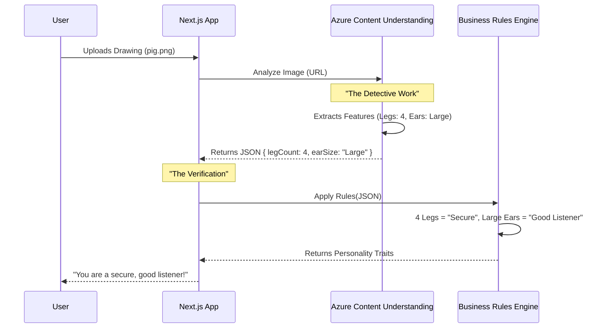
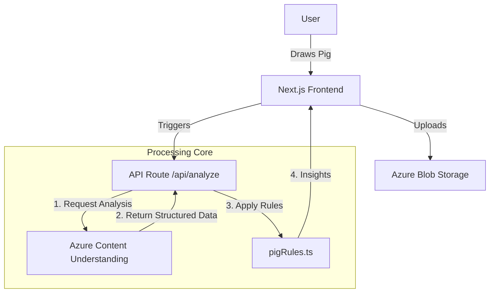

# Insights from Unstructured Data with Azure Content Understanding

**"I know Kung Fu."**

Remember that moment in *The Matrix*? Neo gets plugged in, a program loads, and seconds later—he’s an expert. He didn’t spend years practicing in a dojo; the knowledge was simply… *available*.

Imagine if your applications could do that with your data.

Right now, your company is sitting on a mountain of "unstructured" data: call recordings, PDF contracts, hours of video footage. It’s valuable, but it’s chaotic. Conventional code can’t read it. You can’t write a SQL query to `SELECT * FROM CallRecording WHERE CustomerIsAngry = true`. 

But what if you could?

This article explores **Azure Content Understanding**, a new service that acts like that Matrix upload for your apps. We’ll look at how it turns the chaos of raw files into the order of structured data, using a fun, real-world example: **The Pig Personality Test**.

## The Concept: The Data Detective

Think of traditional programming as a librarian. It’s great at organizing books (structured data) that are already labeled. But if you hand it a messy pile of handwritten notes or a VHS tape, it’s lost.

Azure Content Understanding is your **Data Detective**. You don’t tell it *how* to read the data; you tell it *what* to look for. You give it a "schema"—a list of clues—and it scours the file to find them.

- **You say**: "Find the date, the total amount, and the vendor."
- **It says**: `{ "date": "2023-10-12", "amount": 450.00, "vendor": "Contoso" }`

It doesn’t matter if that info is in a scanned PDF, a spoken phrase in a video, or a handwritten note. The Detective standardizes it.

## The Architecture: How It Works

Let’s visualize the flow. We are sending a raw image (a drawing of a pig) to Azure. The AI analyzes it and returns structured JSON. Our code then applies "Business Logic" to that JSON to generate a result.



### The System Setup

Here is how the pieces fit together in our repository:



## Tutorial: Building the Pig Personality Test

We have built a web app where users draw a pig, and the AI interprets their personality. Let’s break down how we built the "brain" of this application.

### Step 1: The Blueprint (The Schema)

First, we need to tell our Data Detective what to look for. We don't want a generic description like "A drawing of a pig." We need specific data points to run our personality test.

We define this in a generic analyzer configuration. Here is a snippet from `pig-feature-analyzer.json`:

```json
{
  "fieldSchema": {
    "fields": {
      "LegCount": {
        "type": "number",
        "description": "Number of legs visible in the pig drawing"
      },
      "EarSize": {
        "type": "string",
        "description": "Size of the pig ears: Large or Normal"
      },
      "TailLength": {
        "type": "number",
        "description": "Relative tail length from 0 to 1"
      }
    }
  }
}
```

**Key Insight**: We are forcing the AI to output *data types*, not just text. `LegCount` is a `number`. If the AI sees three legs, it gives us the number `3`, not the string "three".

### Step 2: The Setup

To run this yourself, you can check out the **[GitHub Repository](https://github.com/rondagdag/pig-personality-test)**.

For detailed guides, check out:
*   **[Deployment Guide](https://github.com/rondagdag/pig-personality-test/blob/main/docs/DEPLOYMENT.md)**: Full instructions for setting up the Azure Infrastructure (Terraform).
*   **[README](https://github.com/rondagdag/pig-personality-test/blob/main/README.md)**: Quickstart for running the app locally.

### Get Started:

1.  **Clone & Install**:
    ```bash
    git clone https://github.com/rondagdag/pig-personality-test
    cd pig-personality-test
    npm install
    ```

2.  **Configure Environment**:
    We need to tell the app where our Azure resources live.
    ```bash
    cp .env.example .env.local
    ```
    (Fill in your `CONTENT_UNDERSTANDING_ENDPOINT` and `KEY` from the Azure Portal).

3.  **Run Locally**:
    ```bash
    npm run dev
    ```

### Step 3: The Magic (Extraction vs. Interpretation)

This is the most critical concept in this architecture. We distinctly separate **Extraction** (AI) from **Interpretation** (Code).

#### The Extraction (AI)
The `content-understanding.ts` file handles the conversation with Azure. We send the image URL, and Azure returns the facts.

> **AI's Job**: "I see a drawing. It has 4 legs. The ears are large. The tail is curly."

It does *not* say "This person is stubborn." That is an opinion. The AI deals in facts.

#### The Interpretation (Code)
Once we have the reliable facts from the AI, our code takes over. This happens in `pigRules.ts`:

```typescript
// pigRules.ts

function evaluateLegCount(detection: Detection) {
  const legCount = detection.legCount; // Value from AI: 4

  // Our Business Logic
  if (legCount === 4) {
    return "You value security and stability.";
  } else if (legCount < 4) {
    return "You are living life on the edge!";
  }
}
```

> **Code's Job**: "If legs == 4, then trait = Secure."

**Why this separation matters**:
1.  **Control**: You can change the "meaning" of 4 legs without re-running the costly AI analysis.
2.  **Consistency**: The AI provides a stable input. Your code provides the consistent business output.
3.  **Auditability**: If a user asks "Why did you say I'm stubborn?", you can trace it back: "Because the AI detected 0 legs."

## A-Ha Moments

### Consistency is King
If you asked a standard LLM to "describe this pig," it might say "It's a cute piglet" one time and "A sketch of a farm animal" the next. That's nightmare for code integration.
Azure Content Understanding returns structured, schema-compliant JSON. `LegCount` is always a number. `EarSize` is always an enum value we defined. It turns "creative" AI into a "reliable" API component.

### Broad Applications
We used pigs, but this pattern applies everywhere:

*   **Call Center Audio**:
    *   *AI Extraction*: Customer tone (Angry), keywords ("Cancel", "Refund").
    *   *Code Interpretation*: If Tone=Angry AND Keyword=Cancel -> Auto-escalate to Manager.
*   **Video Archives**:
    *   *AI Extraction*: Speakers, topics discussed, visual aids used.
    *   *Code Interpretation*: Search engine indexing.
*   **Insurance Claims (Photos)**:
    *   *AI Extraction*: Bumper dented, windshield cracked.
    *   *Code Interpretation*: Auto-approve estimates under $500.

## Conclusion

We’ve moved from the movie magic of *The Matrix* to the practical magic of modern engineering. Azure Content Understanding doesn’t just "read" your files; it *understands* them in a way your code can actually use.

By building a clear boundary between **AI Extraction** (finding the data) and **Business Interpretation** (using the data), you build systems that are powerful, reliable, and capable of turning your unstructured chaos into structured insights.

Stop searching for your spreadsheet data. Start asking your data questions.
